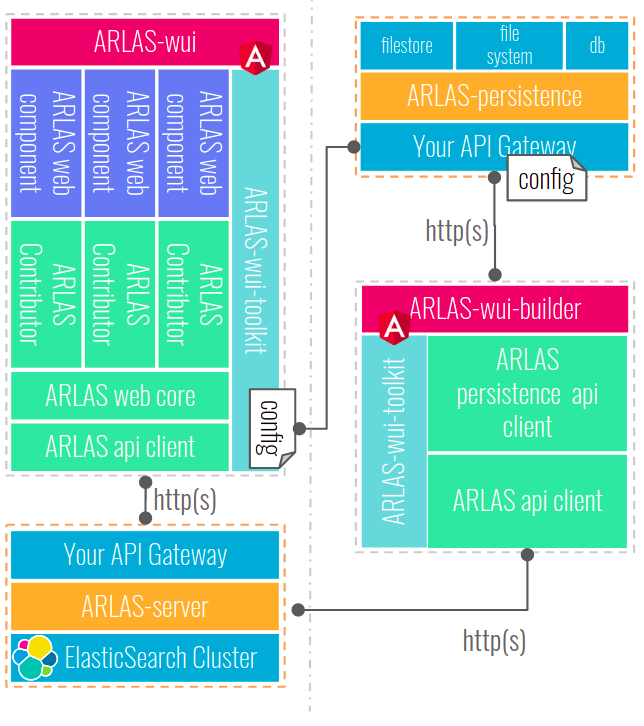

**Hi there!**

We are excited to welcome you to our community.

    

People who have adopted ARLAS are benefiting from:
- quickly building scalable geo big data exploration platforms
- developing robust behaviour and trend analysis platforms
- easily merging data from multiple sources for comprehensive views
- and many other benefits that drive geospatial intelligence.

We would be happy to hear about your project. Please see more details below.

# Gisaïa

    

We are a technology company that offers robust solutions for geoanalytics. We help decision makers who want to implement data-driven decision strategies.

To accelerate this, we built the ARLAS stack, an open source software technology brick that is OGC compliant to promote transparency and continuity.

# ARLAS

    

## Introduction

ARLAS is an open source platform for exploring huge volumes of spatio-temporal data. With ARLAS, you don’t need to be an expert in order to appreciate the subtleties of your data lake and gain valuable business insights. You can explore and filter interactively your geospatial data through:
- geographical distribution with Gridmaps and Heatmaps
- temporal distribution
- a large set of widgets that highlight categorical and numerical distibutions of your data

    

For more information about what ARLAS can do, check out [ARLAS' doc](https://docs.arlas.io/introduction-arlas/).

## How to begin

If you want to begin with ARLAS, we recomend you to take a look at the [ARLAS Exploration stack](https://github.com/gisaia/ARLAS-Exploration-stack) repository, which is used to start ARLAS locally.

There are a few tutorials available, that can be found in the following repositories:

- [Explore air pollution](https://github.com/gisaia/ARLAS-stack-openAQ-tutorial)
- [Monitor ship movements in the Baltic Sea](https://github.com/gisaia/ARLAS-stack-ais-tutorial)
- [Follow stork migrations](https://github.com/gisaia/ARLAS-stack-birdstracking-tutorial)
- [Browse Flickr images through space and time](https://github.com/gisaia/ARLAS-stack-photo-flickr-tutorial)

# For developers

    

1.  [ARLAS-wui](https://github.com/gisaia/ARLAS-wui) is composed of a set of highly interactive & reusable analytic components : MapCompoent, HistogramComponent, ...
    * The components are developped in [ARLAS-web-components](https://github.com/gisaia/ARLAS-web-components) project.
    * Each component is fed with data thanks to a contributor that uses the [ARLAS-server API client](https://github.com/gisaia/ARLAS-server). The contributors are developped in [ARLAS-web-contributors](https://github.com/gisaia/ARLAS-web-contributors) project.
    * A contributor also listens to the filters applied on the component and passes them to the other contributors. These collaborative contibutions are assured by [ARLAS-web-core](https://github.com/gisaia/ARLAS-web-core)
    * [ARLAS-wui-toolkit](https://github.com/gisaia/ARLAS-wui-toolkit) is the library that allows to parse the declared components and maps them to their corresponding contributors. Check [the documentation](https://docs.arlas.io/build-your-wui/) out to get more details about how to build your own ARLAS-wui. 

2.  The search and analytics capabilities of ARLAS-wui are assured by [ARLAS-server](https://github.com/gisaia/ARLAS-server), a stateless and lightweight server offering REST services for data analytics and OGC services for a high interoperability

3. Declaring components to be viewed in ARLAS-wui is possible thanks to [ARLAS-wui-builder](https://github.com/gisaia/ARLAS-wui-builder)
    * ARLAS-wui-builder generates a `config` object containing all the declared components and their corresponding contributors
    * ARLAS-wui-toolkit parses the `config` object and creates the views according to its content.

4. The generated `config` object is persisted thanks to [ARLAS-persistence](https://github.com/gisaia/ARLAS-persistence). It's a stateless and lightweight server that stores the `config` object in your file system, a filestore or a database.

# Links and websites

- [Gisaïa](https://gisaia.com/)
- [ARLAS](https://www.arlas.io/)
- [ARLAS doc](https://docs.arlas.io/introduction-arlas/)
- [ARLAS brochure](https://gisaia.com/wp-content/uploads/2023/03/Brochure-GIS-Expert-Print-version-3.pdf)